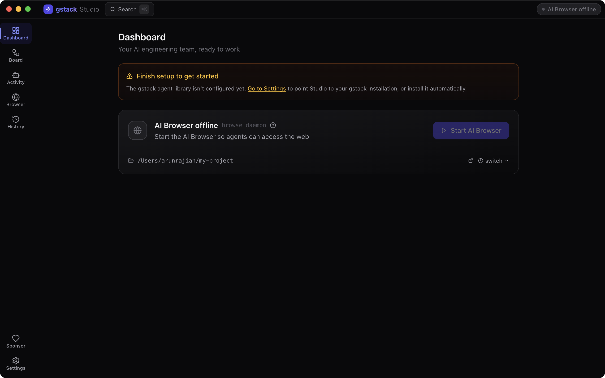
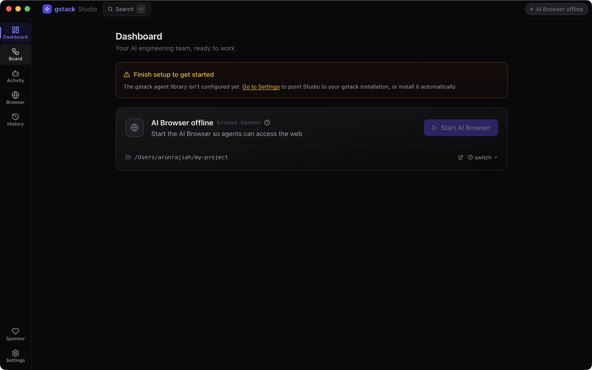
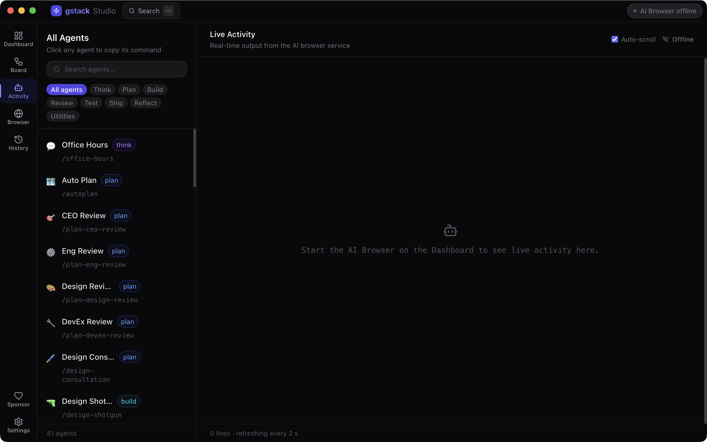
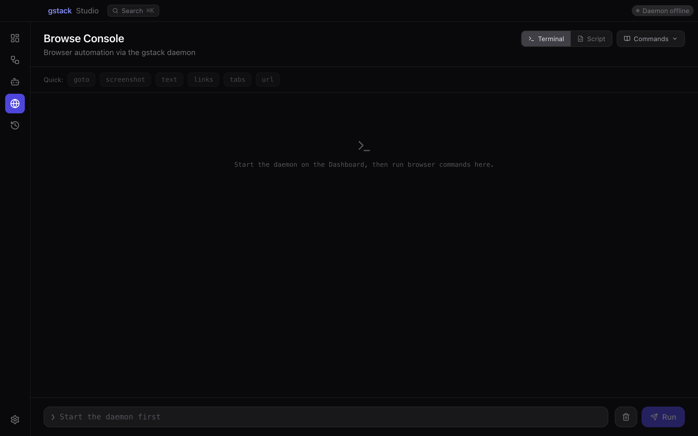
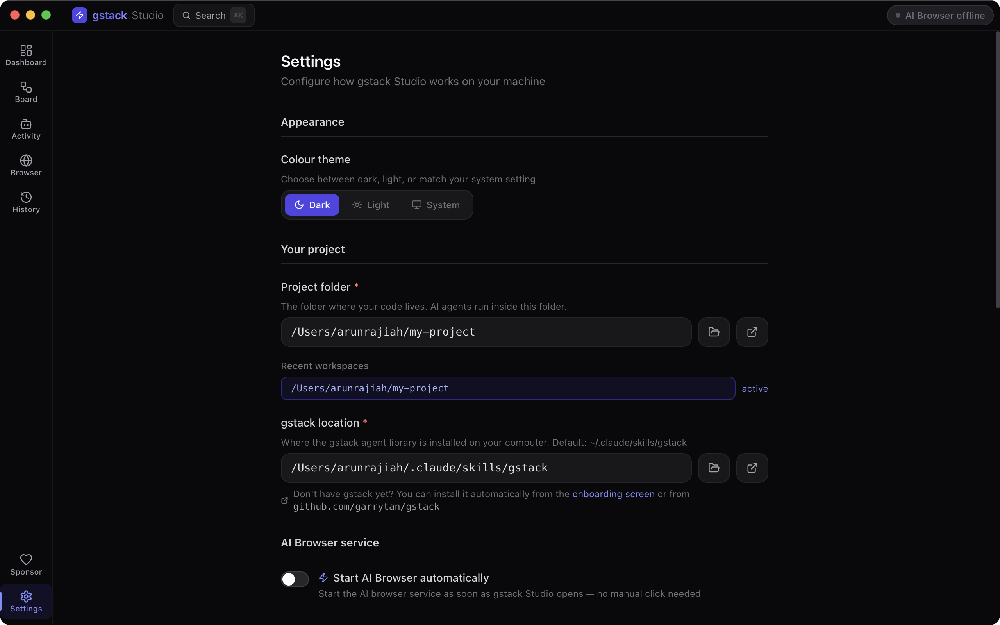
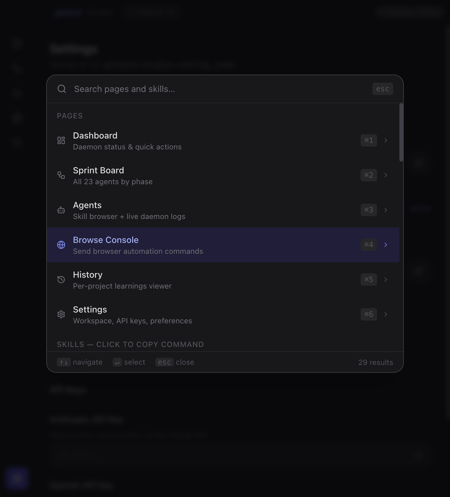

<div align="center">
  <h1>gstack Studio</h1>
  <p><strong>A visual desktop app for <a href="https://github.com/garrytan/gstack">gstack</a> — run every AI engineering agent without touching the CLI.</strong></p>

  <p>
    <a href="https://github.com/arunrajiah/gstack-studio/releases/latest"></a>
    <a href="https://github.com/arunrajiah/gstack-studio/releases"></a>
    <a href="LICENSE"></a>
    <a href="https://github.com/arunrajiah/gstack-studio/actions/workflows/build.yml"></a>
    <a href="https://github.com/garrytan/gstack"></a>
  </p>

  <p>
    <a href="https://github.com/sponsors/arunrajiah"></a>
  </p>

  <p>
    <a href="#-download">Download</a> ·
    <a href="#-features">Features</a> ·
    <a href="#-prerequisites">Prerequisites</a> ·
    <a href="#-getting-started">Getting Started</a> ·
    <a href="#-contributing">Contributing</a>
  </p>
</div>

---

> **gstack Studio is a companion app for [gstack](https://github.com/garrytan/gstack).**
> It does not replace gstack — it wraps it in a polished GUI so you can discover agents, copy slash commands, monitor the browse daemon, and review project history, all without memorising CLI commands.

---

## 📸 Screenshots

<table>
  <tr>
    <td align="center" width="50%">
      
      <br /><sub><b>Dashboard</b> — daemon health, Start/Stop/Restart, quick actions</sub>
    </td>
    <td align="center" width="50%">
      
      <br /><sub><b>Sprint Board</b> — agents organised by phase, click to copy command</sub>
    </td>
  </tr>
  <tr>
    <td align="center" width="50%">
      
      <br /><sub><b>Agents</b> — skill browser with live daemon log stream</sub>
    </td>
    <td align="center" width="50%">
      
      <br /><sub><b>Browse Console</b> — Terminal & Script modes for browser automation</sub>
    </td>
  </tr>
  <tr>
    <td align="center" width="50%">
      
      <br /><sub><b>Settings</b> — workspace, gstack path, API keys, auto-start daemon</sub>
    </td>
    <td align="center" width="50%">
      
      <br /><sub><b>Command Palette (⌘K)</b> — instant search across pages and all skills</sub>
    </td>
  </tr>
</table>

---

## ✨ Features

| Page | What it does |
|------|-------------|
| **Dashboard** | Daemon health, Start / Stop / Restart controls, workspace quick-switcher with recent paths, Open in Finder button |
| **Sprint Board** | Visual pipeline (Think → Plan → Build → Review → Test → Ship → Reflect) with all agents — auto-syncs with your local gstack install. Click any card to copy its `/command`; hover for the 📖 doc viewer |
| **Agents** | Searchable skill browser with phase filter + live daemon log stream (stdout/stderr, polls every 2 s); per-skill doc viewer |
| **Browse Console** | Live terminal interface to the gstack browse daemon — send any of the 56 HTTP commands and see JSON responses |
| **History** | Per-project learnings with full-text search, stored in `~/.gstack/projects/*/learnings.jsonl` |
| **Settings** | Workspace path (with native folder picker + Open in Finder), gstack install path, API keys, recent-workspace list |

### Additional capabilities

- **First-launch onboarding wizard** — guided 3-step setup appears automatically when gstack path or workspace isn't configured yet
- **Skill documentation viewer** — reads each skill's `SKILL.md` and renders it inline (headings, bold, code blocks) with a Copy Command button
- **Auto-update** — checks GitHub Releases on startup; shows a download banner in the title bar when a new version is available
- **Custom window chrome** (Windows / Linux) — native Min / Max / Close buttons integrated in the app title bar
- **Error boundary** — each page catches React errors and shows a graceful fallback UI

### What gstack Studio is NOT
- It does not execute agents — agents run inside Claude Code as slash commands
- It does not modify gstack in any way — zero changes to the gstack codebase (Layer 1 integration only)
- It is not a replacement for the Claude Code CLI

---

## ⬇️ Download

> Pre-built binaries are attached to every [GitHub Release](https://github.com/arunrajiah/gstack-studio/releases).

| Platform | Format | Download |
|----------|--------|----------|
| macOS (Apple Silicon) | `.dmg` | [Latest release →](https://github.com/arunrajiah/gstack-studio/releases/latest) |
| macOS (Intel) | `.dmg` | [Latest release →](https://github.com/arunrajiah/gstack-studio/releases/latest) |
| Windows (x64) | `.exe` installer | [Latest release →](https://github.com/arunrajiah/gstack-studio/releases/latest) |
| Linux (x64) | `.AppImage` / `.deb` | [Latest release →](https://github.com/arunrajiah/gstack-studio/releases/latest) |

Or build from source — see [Development](#-development).

---

## 🔑 Prerequisites

1. **[gstack](https://github.com/garrytan/gstack)** installed at `~/.claude/skills/gstack` (or a custom path set in Settings)
2. **[Bun](https://bun.sh)** — required to run the gstack browse daemon (`brew install bun`)
3. An **Anthropic API key** if you plan to run agents programmatically

> gstack Studio works on macOS, Windows, and Linux, but the gstack browse daemon currently requires Bun, which must be installed separately.

---

## 🚀 Getting Started

### 1. Install gstack Studio

Download the installer for your platform from [Releases](https://github.com/arunrajiah/gstack-studio/releases) and run it.

### 2. Configure your workspace

On first launch an **onboarding wizard** guides you through setup automatically. You can also configure paths at any time in **Settings**:

- **Workspace Directory** — the project folder where you run gstack (e.g. `~/my-project`). The daemon will start from this directory.
- **gstack Install Path** — where gstack is installed (default: `~/.claude/skills/gstack`).
- **Anthropic API Key** — optional, stored locally in `~/.gstack/studio-config.json`.

### 3. Start the daemon

Go to **Dashboard** and click **Start Daemon**. The status dot turns green when the browse server is live.

### 4. Copy slash commands

Open the **Sprint Board**, find any agent, and click its card. The slash command (e.g. `/review`) is copied to your clipboard — paste it straight into Claude Code.

---

## 🗺️ Roadmap

- [x] **Layer 1** — Read-only GUI: Sprint Board, Browse Console, History, Settings
- [x] **Layer 2** — Daemon controls (Stop/Restart), workspace switcher, native folder picker, recent workspaces
- [x] **Layer 3** — Live daemon log streaming, Agents command centre with searchable skill browser
- [x] **v0.3.0** — Onboarding wizard, skill doc viewer, Open in Finder, auto-update, custom title bar, error boundary, app icon
- [x] **v0.4.0** — Toast notifications, Browse Console history + command reference, auto-start daemon, copy logs, keyboard shortcuts (⌘1–6), app version display
- [x] **v0.5.0** — Command palette (⌘K), Sprint Board search, History export (JSON/MD), Browse Console script runner
- [ ] Dark/light theme toggle
- [ ] Windows / macOS code signing for distribution without Gatekeeper warnings
- [ ] Direct agent execution (run gstack commands from within Studio)

---

## 🛠️ Development

### Stack

- **Electron 33** + **electron-vite** — app shell
- **React 18** + **React Router v6** — renderer UI
- **Tailwind CSS v3** — styling
- **TypeScript** throughout
- **electron-builder** — cross-platform packaging

### Setup

```bash
# Clone
git clone https://github.com/arunrajiah/gstack-studio.git
cd gstack-studio

# Install dependencies
npm install

# Start dev server (hot reload)
npm run dev
```

### Build

```bash
# Type-check only
npm run typecheck

# Build all platforms (requires code signing certs for distribution)
npm run package

# Build for a specific platform
npm run package:mac
npm run package:win
npm run package:linux
```

Artifacts go to `dist/`.

### Project layout

```
gstack-studio/
├── scripts/
│   └── generate-icon.mjs     # Pure Node.js app icon generator (no external deps)
├── build/
│   └── icon.png              # Generated 1024×1024 app icon
├── src/
│   ├── main/                 # Electron main process (Node.js)
│   │   ├── index.ts          # App bootstrap, BrowserWindow, auto-updater
│   │   ├── daemon.ts         # GStackDaemon — spawn/stop browse server
│   │   └── ipc.ts            # IPC handlers exposed to renderer
│   ├── preload/
│   │   └── index.ts          # contextBridge — exposes window.gstack API
│   └── renderer/
│       └── src/
│           ├── App.tsx       # Router + layout shell
│           ├── components/
│           │   ├── Layout.tsx        # App shell with onboarding gate
│           │   ├── Titlebar.tsx      # Drag bar + daemon pill + update banner
│           │   ├── WindowControls.tsx # Min/Max/Close (Windows/Linux only)
│           │   ├── Sidebar.tsx       # Navigation
│           │   ├── ErrorBoundary.tsx # Page-level error fallback
│           │   └── SkillDocModal.tsx # SKILL.md viewer modal
│           ├── lib/
│           │   ├── gstack-client.ts  # window.gstack typed wrapper
│           │   └── store.ts          # React hooks (useDaemon, useSkills, useConfig…)
│           └── pages/
│               ├── Onboarding.tsx    # First-launch 3-step setup wizard
│               ├── Dashboard.tsx
│               ├── Sprint.tsx
│               ├── Browse.tsx
│               ├── History.tsx
│               ├── Agents.tsx
│               └── Settings.tsx
├── .github/
│   ├── workflows/
│   │   └── build.yml   # CI: type-check on PR, release binaries on tag
│   └── ISSUE_TEMPLATE/
├── electron-builder.yml
├── electron.vite.config.ts
└── package.json
```

---

## 🤝 Contributing

We welcome contributions of all kinds — bug fixes, new features, docs improvements, and design feedback.

Please read [CONTRIBUTING.md](CONTRIBUTING.md) before opening a pull request.

**Quick start:**

```bash
# Fork → clone → branch
git checkout -b feat/your-feature

# Make changes, then
npm run typecheck   # must pass
npm run dev         # manual test

# Commit using Conventional Commits
git commit -m "feat: add agent filter by phase"

# Push and open a PR against main
```

---

## 🔗 Related

- [garrytan/gstack](https://github.com/garrytan/gstack) — the AI agent framework this app wraps *(required)*
- [Anthropic Claude Code](https://docs.anthropic.com/en/docs/claude-code) — the CLI where gstack agents actually run

---

## 📄 License

MIT — see [LICENSE](LICENSE).

---

<div align="center">
  <sub>Built with ♥ as an open-source companion to <a href="https://github.com/garrytan/gstack">gstack</a>.</sub>
</div>
